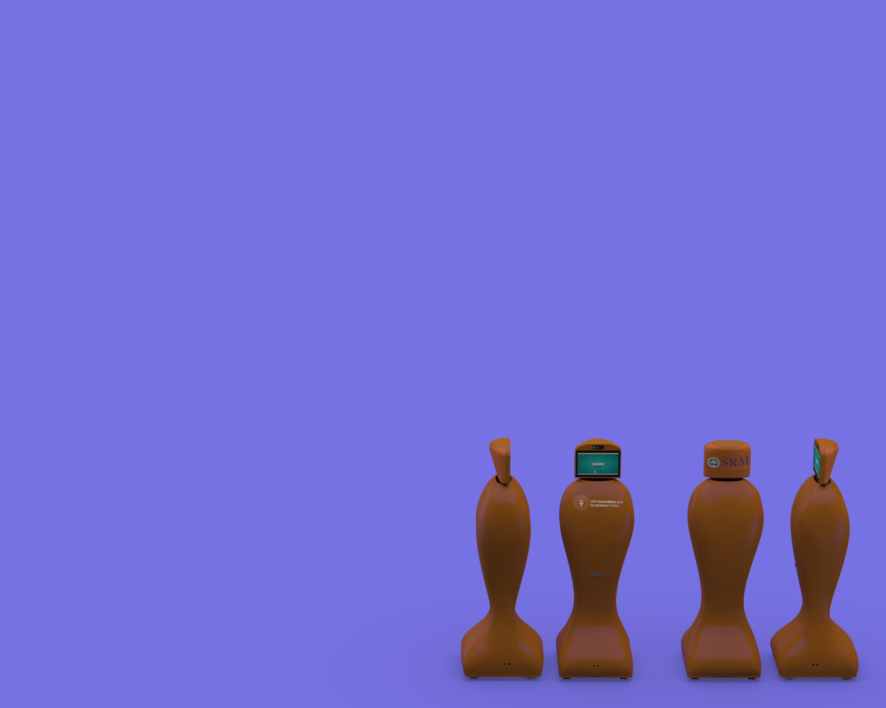
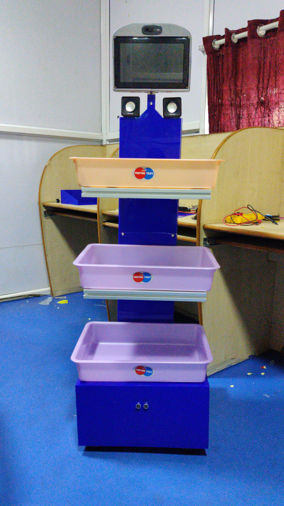
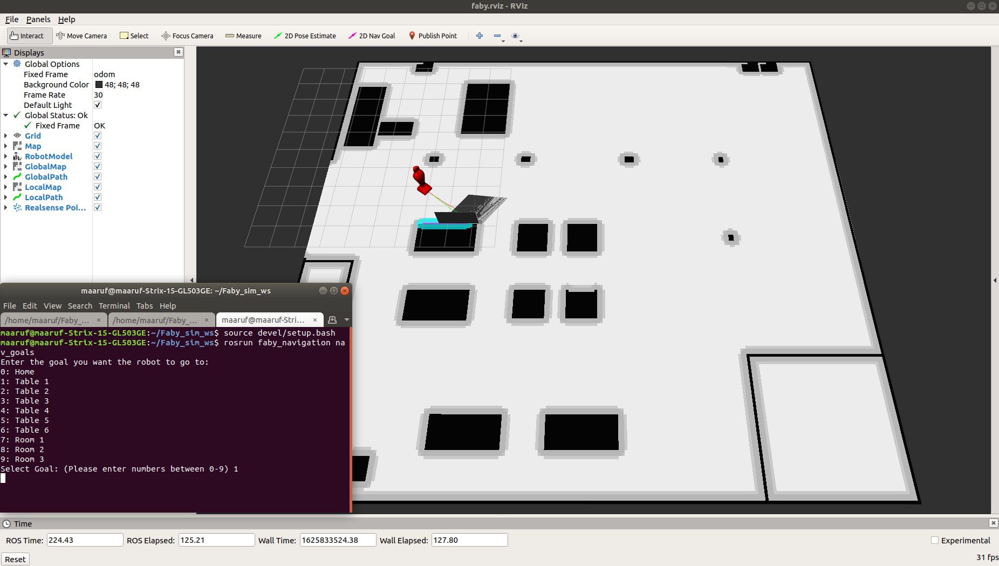
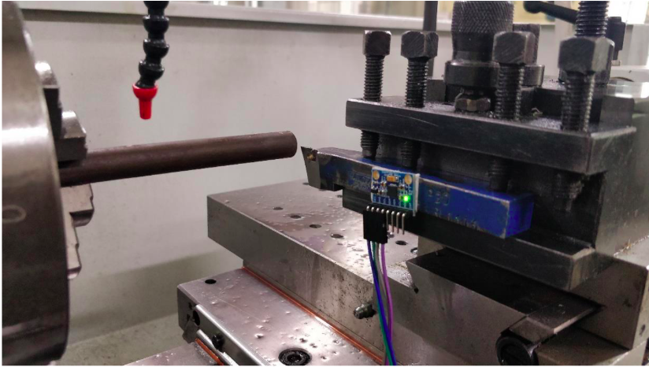
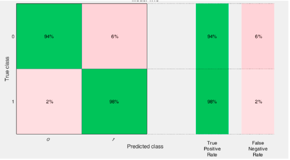
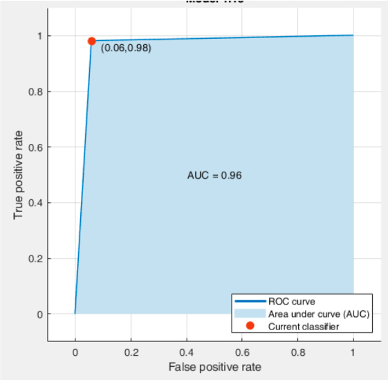

**Maitreya Kulkarni**

Hello Everyone!, I am Maitreya, a Graduate student at University of Maryland Marjoring in Robotics Engineering. I did my undergraduate program in Mechatronics Engineering from SRM University, Chennai,India.

## [Here is my Resume](./files/Maitreya_resume.pdf).

### These are my Technical Skills

*   ROS
*   C++
*   Pyhton
*   Matlab
*   Solidworks

# Here are some of my projects 
## 1. Faby : The telepresence Robot
 

Faby is an autonomous telepresence robot which was used for di-directional communications. Robot has interactive user interface and Google assistant. The robot is currently deployed in Fablab of SRM University. The robot is incorporated with dynamic and static obstacle avoidance.

My contribution 
* Represented robot as an URDF model, rospy scripts for movement of robot in world
* Configuration and tuning of ROS navigation stack. 
* Comparison, configuration and tuning of G-mapping and RTAB mapping algorithms and selecting ideal one for indoor use.
* Using rosbridge server to link the Robot Userinterface with navigation stack.
* Using firebase to enable robot to be manually controller using a mobile application.
* Fabrication of the robot.

The robot was later modified to accomodate trays so that the robot could be used to deliver tools to students working in the lab. Here is the link is to the project repository [link](https://github.com/maitreya98/faby_sim).

  

## 2. Tool wear prediction by monitoring vibrations 
Prediction of tool wear by monitoring the vibrations generally based on the concept, where the vibration created during the machining process is in correlation with the tool wear phenomenon. The prior detection of tool wear phenomenon can provide increase of performance in process of machining. Substantial amount of variations in the vibrations of the machine and tool are acquired through the MPU-6050 sensor and is uploaded to a cloud server. Relationship was established between the speed, depth of cut, feed rate and vibrations. With all the values recorded from the cloud server a machine learning mode was trained to predict the tool wear prior to the occurrence of this phenomenon. These results provide initial elements towards the implementation of online monitoring and predictive maintenance of the tools and machine.

 

The components are a NodeMCU and a MPU-6050 accelerometer + gyro which is connected to laptop through a USB cable which is source of power for the NodeMCU. The vibration from the machining process is sensed by the sensor is sent to NodeMCU, all the data received is sent to MATLAB cloud platform Thingspeak. The machining parameters such as spindle speed and depth of cut are hardcoded in the code. The data that was uploaded is stored and was imported as a CSV file in the MATLAB workspace. The data that was imported contained raw acceleration data, this data was worked upon and manipulated and all the acceleration values were changed to corresponding frequency values using the formula given in following table. Using the new manipulated data a machine learning model was trained using classification learner in MATLAB. 

We used two different models for the prediction of the tool wear namely: Fine KNN and SVM. The above model types were chosen due to the high accuracy The above models also gave a high cross-validation accuracy. As our prediction is based on classification we chose to go with Fine KNN. The Fine KNN model gave us the training accuracy of 97.1%. The trained model was later imported and prediction is made using the last data uploaded to the Thingspeak cloud. Here is the link to the project [link](https://github.com/maitreya98/Prediction-of-Tool-Wear).

Here is the confusion matrix:

 

ROC:

 

